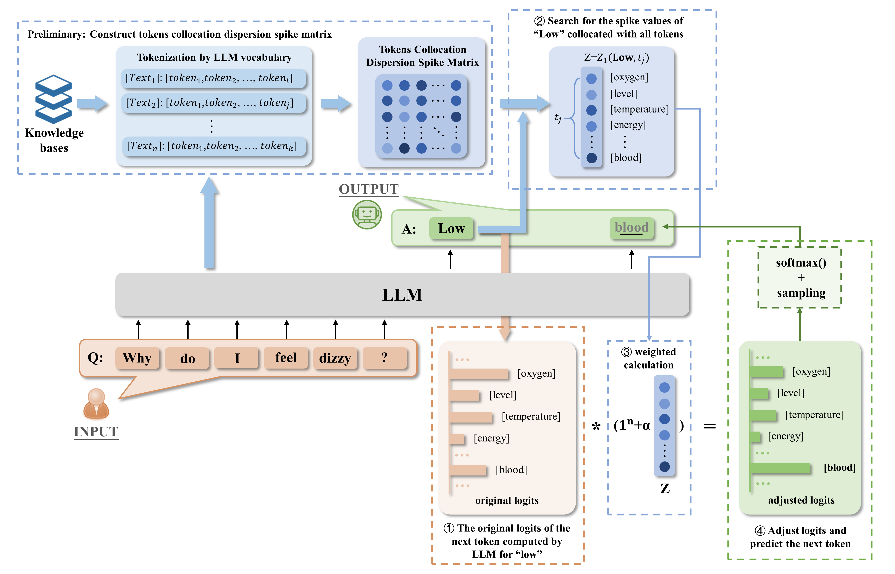

# Fake-Learning for Qwen

## What is Fake-Learning?

Fake-Learning is a novel approach to enhance the generation quality of large language models by leveraging token collocation patterns. The core idea is to capture and utilize the statistical relationships between tokens that frequently appear together in natural text.

### Key Concepts

- **Token Collocation Spike Values**: These values represent the strength of association between token pairs based on their co-occurrence patterns in the training corpus. Tokens that frequently appear together exhibit higher spike values.

- **Dispersion-based Logits Adjustment**: During generation, Fake-Learning adjusts the model's output logits by incorporating token collocation information, guiding the model toward more natural and coherent token sequences.

- **Alpha Parameter**: A tunable hyperparameter (α) that controls the balance between the original model predictions and the Fake-Learning enhancement. Higher alpha values give more weight to token collocation patterns.

### How It Works

1. **Pre-computation**: Before inference, we compute a sparse matrix of token collocation spike values from a large corpus, capturing pairwise token associations.

2. **Runtime Adjustment**: During generation, for each predicted token, the algorithm:
   - Retrieves the collocation spike values for the previous token
   - Adjusts the logits using a dispersion-based scoring mechanism
   - Combines the adjusted scores with the original model output using the alpha parameter

3. **Enhanced Generation**: The result is a generation process that maintains the model's original capabilities while benefiting from statistical token patterns, leading to more coherent and contextually appropriate outputs.

### Benefits

- **Improved Coherence**: By leveraging token collocation patterns, the model generates more natural and fluent text.
- **Domain Adaptation**: The token collocation matrix can be computed from domain-specific corpora to adapt the model to specialized fields.
- **Plug-and-Play**: Fake-Learning can be integrated into existing models without retraining, requiring only the pre-computed collocation matrix.



## How to Use

### Method 1: Manual Integration

To integrate Fake-Learning into your Qwen model, follow these steps:

1. **Copy the logits modifier**: Copy `modify_logits.py` to your Qwen model directory.

2. **Replace the modeling file**: Replace the original `modeling_qwen.py` with the provided `modeling_qwen.py` from this repository.

3. **Download the token collocation matrix**: Download the pre-computed `TokenCollocationSpikeValues_Matrix.mtx` file from HuggingFace and place it in your Qwen model directory.
   
   Download link: [TokenCollocationSpikeValues_Matrix.mtx](https://huggingface.co/ZhixiaoQi/Qwen-7B-chat-Fake-Learning/blob/main/TokenCollocationSpikeValues_Matrix.mtx)

### Method 2: Direct Download from HuggingFace

Alternatively, you can directly download our pre-packaged Qwen-7B Fake-Learning model from HuggingFace:

**Model Link**: [Qwen-7B-chat-Fake-Learning](https://huggingface.co/ZhixiaoQi/Qwen-7B-chat-Fake-Learning)

## Loading and Inference

Loading and inference with the Fake-Learning enhanced model is identical to the original Qwen model.

### Loading the Model

```python
import numpy as np
from transformers import AutoModelForCausalLM, AutoTokenizer
from transformers.generation import GenerationConfig

MODEL = "path/to/your/Qwen-7B-chat-Fake-Learning"

# Load tokenizer
tokenizer = AutoTokenizer.from_pretrained(MODEL, trust_remote_code=True)

# Load model
model = AutoModelForCausalLM.from_pretrained(MODEL, device_map="auto", trust_remote_code=True).eval()

# Set generation config
model.generation_config = GenerationConfig.from_pretrained(MODEL, trust_remote_code=True)
```

### Running Inference

```python
# Prepare your prompt
prompt = "Your input prompt here"

# Generate response
response, history = model.chat(tokenizer, prompt, history=None)

print(response)
```

## Configuration

The Fake-Learning implementation uses an alpha parameter to control the influence of token collocation spike values on the generation process. You can adjust this parameter when running inference:

```bash
python eval.py --alpha 0.9
```

## Requirements

- Python 3.8+
- PyTorch
- Transformers
- NumPy
- SciPy
- CUDA (recommended for GPU acceleration)

## License

This project is licensed under the same license as the original Qwen model.
